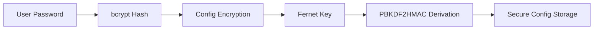

# photel - Secure Screenshot Uploader for Telegram

## Overview
photel is a secure, cross-platform application that automatically captures screenshots and uploads them to Telegram with robust encryption and reliability features. Designed for both technical and non-technical users.

## Key Features 🔑
- **Military-Grade Encryption 🔒**
  - Configurations encrypted using AES-256 (PBKDF2HMAC + Fernet)
- **Smart Retry System 🔄**
  - Queue-based uploads with 3 retry attempts and offline storage
- **Stealth Operation 🕶️**
  - Minimal GUI with background operation (hide/show with hotkeys)
- **Drag-and-Drop Interface 👆**
  - Customizable dark-mode GUI built with CustomTkinter
- **Cross-Platform 💻**
  - Works on Windows, macOS, and Linux

## Installation 📦
### Clone Repository
```bash
git clone https://github.com/asnary-amgho/photel.git
cd photel
```

### Install Dependencies
```bash
pip install -r requirements.txt
```
#### Required Packages:
- `bcrypt`
- `cryptography`
- `pillow`
- `telebot`
- `customtkinter`
- `keyboard`

## First-Time Setup 🛠️
### Get Telegram Credentials
1. Create a bot via `@BotFather` and obtain the API Token.
2. Get the Channel ID using `@RawDataBot`.

### Launch Application
```bash
python photel.py
```

### Initial Configuration
Follow the guided setup to provide:
- Telegram API Token
- Channel/Chat ID
- Screenshot save path
- Encryption password

Configurations are securely stored using:
- PBKDF2 key derivation (100,000 iterations)
- bcrypt password hashing (salt + pepper)

## Usage 🖥️
### Hotkey Commands
| Combination     | Action                          |
|---------------|--------------------------------|
| `Shift + `` ` | Capture & upload screenshot   |
| `Ctrl + ]`    | Show/hide application window  |
| `Esc`         | Exit program                   |

### File Management
- **Successful uploads:** Auto-deleted from local storage
- **Failed uploads:** Moved to `./unsent/` directory
- **All files include timestamps:** `screenshot_YYYYMMDDHHMMSSsss.png`

## Security Overview 🔐


## Technical Architecture 🧠
```python
class TelegramScreenshotUploader:
    def enqueue_screenshot():
        pass
    def _send_screenshot():
        pass
    def _safe_delete():
        pass

class DraggableApp:
    def setup_new_user():
        pass
    def verify_password():
        pass
    def screen_capture():
        pass

TelegramScreenshotUploader -- DraggableApp : Aggregation
```

## Contributing 🤝
We welcome contributions! Please follow these steps:
1. Fork the repository
2. Create your feature branch:
   ```bash
   git checkout -b feature/AmazingFeature
   ```
3. Commit your changes:
   ```bash
   git commit -m 'Add some AmazingFeature'
   ```
4. Push to the branch:
   ```bash
   git push origin feature/AmazingFeature
   ```
5. Open a Pull Request

## License 📄
Distributed under the MIT License. See `LICENSE` for more information.

⚠ **Warning:** This application handles sensitive credentials. Always:
- Use strong passwords (12+ characters, mixed types)
- Keep your encryption password secure
- Revoke Telegram API tokens if compromised

